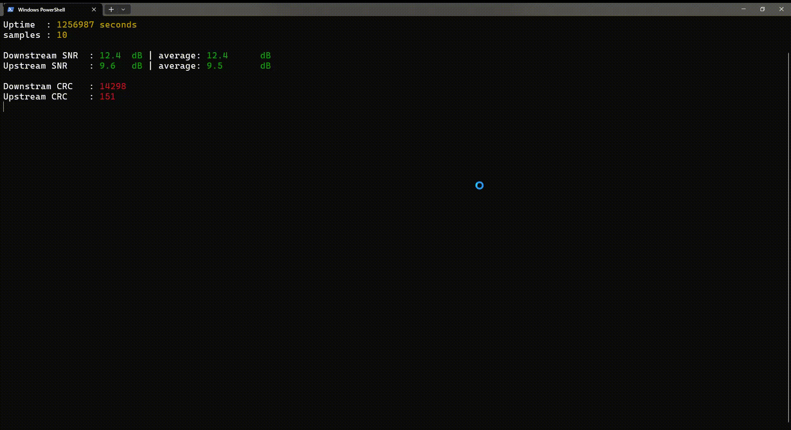

# Asus Modem SNR Monitor

Use this program to monitor `ASUS DSL-N14U B1` SNR and CRC values. I used this program to monitor my SNR status over long periods to detect problems in my network.
to show the values correctly, open this program in `windows terminal` app.

# Sample output

```
asus-snr-monitor.exe
```

